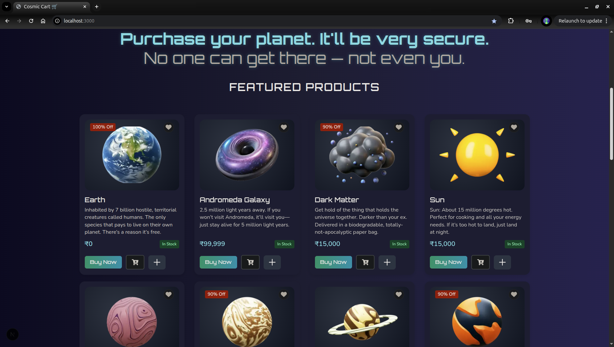
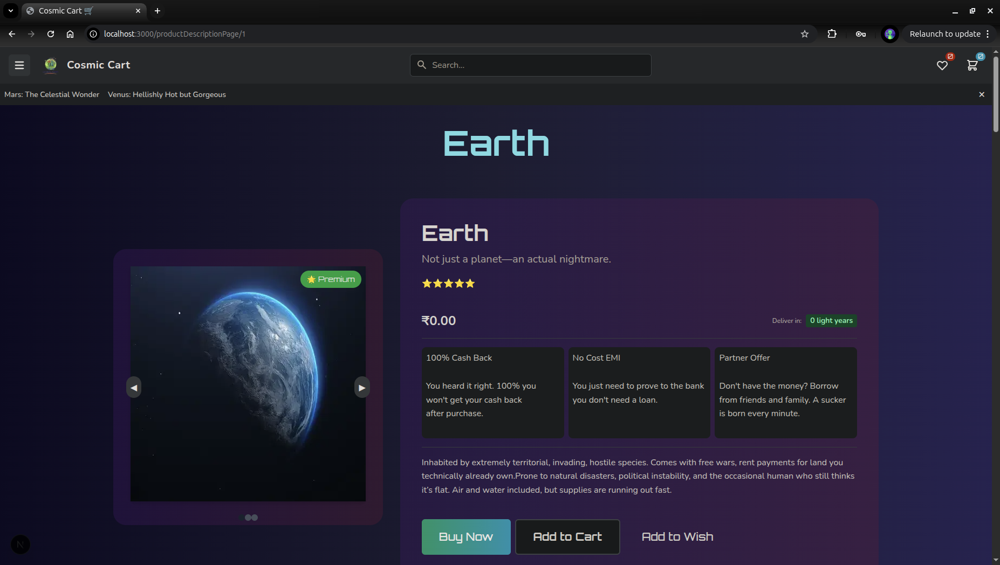
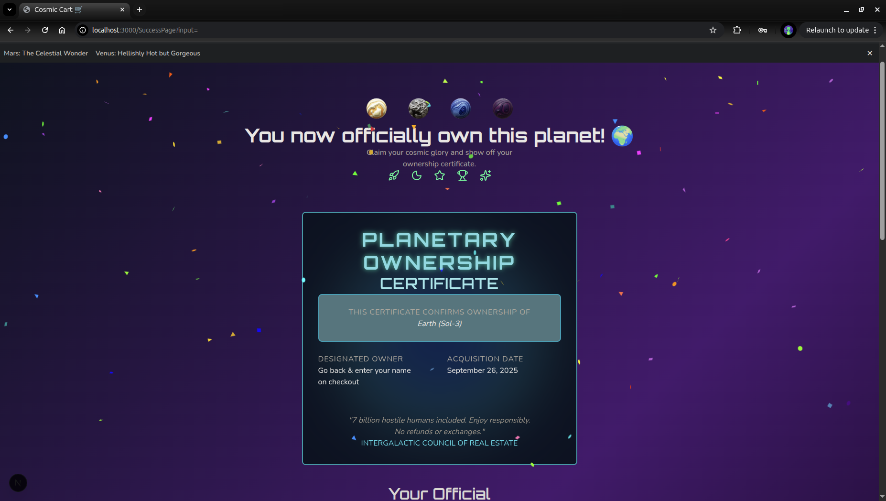
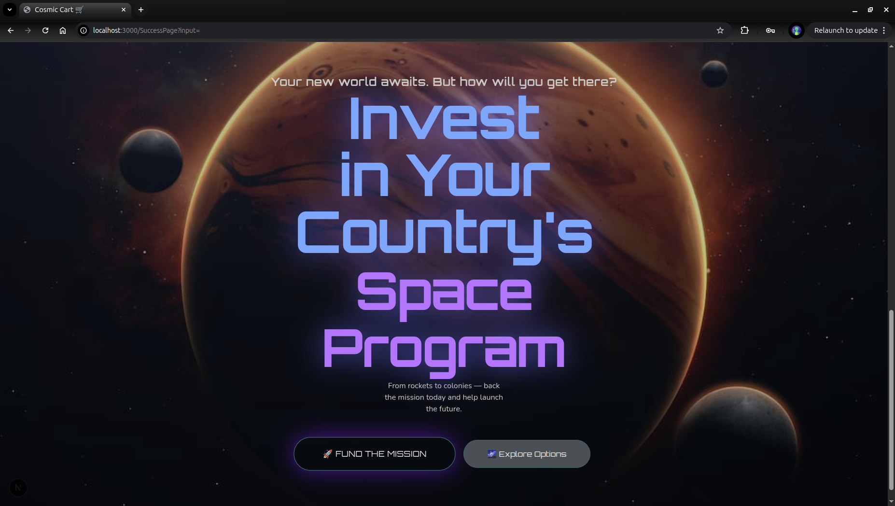

# 🌌 Cosmic Cart – Satire E-Commerce Site for Planets & Solar Systems

_A satirical e-commerce site where you can ‘buy’ planets—designed as a fun and creative way to advertise space programs._

[](https://cosmic-cart-git-main-mknishanth1997s-projects.vercel.app?_vercel_share=8h6MRjLpijZ6bYdl7O1SAybwvlFFWQk7)


---

## 📸 Screenshots

**Listing page**


**Planet Descripton page**

**Checkout page**

**CTA**

**Cosmic Cart** is a satire e-commerce website where users can "purchase" planets and solar systems. The goal is creative advertisement: after a user "buys" a planet, we ask, _"How will you get there?"_ and nudge them to invest in their country’s space programs like NASA or ISRO.

Instead of a flashy landing page, we built a fully functional fake e-commerce site that engages users naturally. Whenever they think about space, they’ll remember Cosmic Cart.

---

## 🚀 Features

- 25 planet listings, fully responsive across devices
- Built with **Next.js** using dynamic routes for all pages
- Offline data passing via **React Context**, but easily connectable to a backend
- Utilizes **React Hot Toast**, **Flowbite Tooltips**, **Flowbite Sidebar**, **Lazy Loading**, and **PDF Downloader** libraries
- Optimized for performance: 250 images totaling **only 4.5 MB**
- Fully reusable component structure with feature-wise organization

---

---

## ⚡ Tech Stack

- **Next.js** – React framework for production
- **React Context API** – State management
- **Flowbite** – UI components (Sidebar, Tooltip, etc.)
- **React Hot Toast** – Toast notifications
- **Lazy Loading** – Optimized image rendering
- **PDF Downloader** – PDF export functionality

---

## 🎨 Design Philosophy

- Satirical but fully functional e-commerce site
- Engages users via **interactive CTA** instead of just a colorful landing page
- Modular, reusable components with clear separation of logic and layout
- Lightweight assets for fast load times

---

## 📂 Component Structure

- **app/** – Layout, pages, dynamic routing
- **components/** – Reusable UI components
- **context/** – Global state management
- **Data/** – Static data for planets & blogs
- **Library/** – Custom or third-party component wrappers
- **checkoutPageComp/** – Checkout-related components
- **cartandwishlistItemsComp/** – Cart and wishlist handling
- **SuccessfullPageComp/** – Post-purchase UI
- **types/** – TypeScript type definitions

---

## 📦 Installation & Run

```bash
# Clone the repo
git clone <https://github.com/mknishanth1997/cosmic-cart.git>
cd cosmic-cart

# Install dependencies
npm install

# Run locally
npm run dev

```

## 📂 Project Structure
